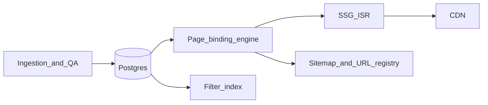

# Programmatic SEO platform: brokers and affiliate programs

## 1. Architecture overview

**Stack posture (implementation-agnostic but concrete):**

- **Rendering**: Static-first (SSG/ISR) for crawl stability; on-demand revalidation when broker/affiliate data changes. Avoid purely client-rendered indexable HTML.
- **Data plane**: Authoritative **relational DB** (Postgres) for entities + normalized facets; **search index** (OpenSearch/Meilisearch/Postgres full-text) for filter UX; optional **analytics warehouse** (BigQuery/Snowflake) for `/stats/*` rollups.
- **Content plane**: **Structured fields** in DB + **block-based page composition** (JSON blocks per template) + **editorial overrides** (unique intros, verdicts, disclaimers) to defeat thin content.
- **SEO plane**: Central **URL registry** table (every indexable URL, canonical target, entity bindings, last_reviewed_at, E-E-A-T fields). **Hreflang** only if multi-locale; otherwise single locale with strict disclaimers.
- **Governance (YMYL)**: `review_status`, `sources[]`, `last_verified_at`, `risk_tier`, mandatory disclosures on money/promotions pages; no auto-generated “financial advice” claims—use templated factual framing.

**High-level flow:**

**Scale target (10k+ pages):** Precompute **eligible page keys** from facet combinations with **inclusion rules** (minimum broker count, minimum data completeness, editorial gate). Do not expose every Cartesian product of facets.

---

## 2. URL structure

**Problem:** Paths like `/brokers/{geo}/`, `/brokers/{feature}/`, and `/brokers/{brand}/` **collide** if all use a single dynamic segment (e.g. `brazil` vs brand slug `brazil`).

**Is `/brokers/in/argentina/` “best practice”?**  
It is **technically clean** (the `in` token reserves a namespace so `argentina` cannot be mistaken for a brand slug), but it is **weak on intent clarity**: URLs do not mirror how people search (“crypto brokers Brazil”, “forex brokers Argentina”). Keywords in the path are a **small** ranking signal today; **H1/title, internal links, and content depth matter more**. Still, **query-shaped slugs** (`forex-brokers`, `crypto-brokers`) improve **scannability in SERPs/snippets**, reduce ambiguity for users, and give you a **controlled vocabulary**—so for this product, **prefer vertical-first paths** over a bare `/in/` segment.

**Recommended primary taxonomy (programmatic = keyword facets + explicit vertical):**

| Intent | Pattern | Example |
|--------|---------|---------|
| Brand hub | `/brokers/{brandSlug}/` | `/brokers/exness/` |
| Affiliate intel | `/affiliate-programs/{brandSlug}/` | `/affiliate-programs/exness/` |
| **Vertical × country (preferred pillar)** | `/{verticalSlug}/{countrySlug}/` | `/crypto-brokers/brazil/`, `/forex-brokers/argentina/` |
| **Country-only hub (all verticals)** | `/brokers/country/{countrySlug}/` | `/brokers/country/argentina/` (clearer than `/in/`; use if you need one “brokers in X” parent without picking a vertical) |
| **Alternate:** vertical under stable prefix | `/directory/{verticalSlug}/{countrySlug}/` | `/directory/crypto-brokers/brazil/` — use if you must avoid root-level `/crypto-brokers/` collision with marketing pages |
| Feature facet (program/broker attribute) | `/brokers/with/{facetSlug}/` | `/brokers/with/high-cpa/`, `/brokers/with/no-kyc/` |
| Combined: vertical × country × facet | `/{verticalSlug}/{countrySlug}/with/{facetSlug}/` | `/crypto-brokers/brazil/with/high-cpa/` |
| Legacy / disambiguation-only option | `/brokers/in/{countrySlug}/{typeSlug}/` | Still valid for routing; **301 to preferred public URL** if you adopt vertical-first slugs |
| Comparisons | `/compare/{a}-vs-{b}/` | `/compare/exness-vs-xm/` (canonical ordering below) |
| Alternatives | `/alternatives/{brandSlug}/` | `/alternatives/exness/` |
| Clone scripts | `/clone-scripts/{brandSlug}/` | `/clone-scripts/exness/` |
| Stats | `/stats/{topicSlug}/` | `/stats/average-cpa-by-broker-type/` |
| Tools | `/tools/revshare-calculator/` | fixed routes |

**Vertical slugs:** Define `market_verticals.slug` in DB (`forex-brokers`, `crypto-brokers`, `cfd-brokers`, etc.)—never parse vertical from free text. **One canonical URL per intent:** do not index both `/crypto-brokers/brazil/` and `/brokers/in/brazil/crypto/`; pick one pattern and redirect the other.

**Cannibalization:** “Crypto brokers in Brazil” vs “Crypto brokers” (global) vs “Brokers in Brazil” (all verticals) are **three distinct intents**—use **three templates** with different H1s and intro copy; link them in a small “Related hubs” module.

**Canonical ordering for comparisons:** Sort `(brand_a, brand_b)` lexicographically by `brand_slug` and **301** duplicates.

**Hub page:** `/brokers/` as entity index; add **`/markets/` or vertical index** listing `/forex-brokers/`, `/crypto-brokers/` hub pages (list of countries or featured pills).

**Avoid duplication:**

- One **canonical** for each intent; facets that differ only by sort order should use query params `?sort=` with `noindex` or canonical to base URL—prefer **no query strings** on PSEO landings.
- **Pagination**: `/page/2/` with `rel=prev/next` historically optional; modern practice is strong internal links + avoid deep paginated thin series; cap lists at N with “expand filters” UX.

---

## 3. Database schema (tables)

**Core entities**

- **`brokers`**
  - `id` (uuid), `slug` (unique), `legal_name`, `brand_status` (active/closed/rebranded)
  - `founded_year`, `hq_country_id` (FK), `website_url`
  - `risk_tier` (enum for YMYL handling), `review_status` (draft/published/needs_review)
  - `last_verified_at`, `data_quality_score` (0–100)
  - Narrative: `overview_md`, `pros_md`, `cons_md` (optional structured blocks)

- **`affiliate_programs`**
  - `id`, `broker_id` (FK unique 1:1 or 1:many if multiple programs)
  - `program_name`, `slug` (unique per broker or globally unique)
  - `cpa_min`, `cpa_max`, `cpa_currency`, `revshare_min`, `revshare_max`
  - `payout_frequency` (enum), `payment_methods` (jsonb array)
  - `cookie_duration_days`, `negative_carryover` (bool), `hybrid_available` (bool)
  - `geo_restrictions_mode` (allowlist/blocklist), `affiliate_tier_notes`
  - `affiliate_url` (tracked outbound), `application_url`
  - `last_verified_at`, `source_urls` (jsonb), `disclosure_template_id`

- **`geos`** (countries + macro regions if needed)
  - `id`, `iso2`, `slug`, `name`, `region_id` (nullable)

- **`broker_geo_availability`**
  - `broker_id`, `geo_id`, `availability` (allowed/restricted/unclear), `notes`, `source_ref`

- **`features`** (controlled vocabulary)
  - `id`, `slug`, `name`, `category` (product/compliance/affiliate/payments)
  - `description`, `synonyms[]` for search

- **`broker_features`** (many-to-many with attributes)
  - `broker_id`, `feature_id`, `value_bool`, `value_num`, `value_text`, `confidence`

- **`market_verticals`** (aligns with URL segments `forex-brokers`, `crypto-brokers`, …)
  - `id`, `slug` (unique), `name`, `sort_order`

- **`broker_verticals`**
  - `broker_id`, `market_vertical_id` (M:N; brokers may span multiple verticals)

- **`licenses`** (optional normalization for YMYL)
  - `broker_id`, `regulator_name`, `license_id`, `jurisdiction_geo_id`, `status`, `source_url`, `last_verified_at`

**Affiliate-specific facets** (normalize hot filters)

- **`affiliate_program_geos`**: `program_id`, `geo_id`, `restriction_type` (accepts/denies/conditional)

**Comparisons & derivatives**

- **`comparisons`**
  - `id`, `slug` (unique), `broker_a_id`, `broker_b_id` (enforce `a < b` by slug order)
  - `title_override`, `editorial_verdict_md`, `last_updated_at`
  - Generated metrics snapshot: `jsonb` (cached CPA spread, regulation diff summary)

- **`clone_script_pages`** / **`alternative_sets`**
  - `brand_id` (subject), `use_cases_md`, `feature_matrix_json`, `provider_notes`
  - `pricing_estimate_low/high`, `pricing_currency`, `methodology_note` (how estimate derived)

**Programmatic SEO engine**

- **`facet_definitions`**: defines allowed programmatic keys: type `geo|facet|combo`, segment slugs, SQL/view name or rule id, `min_brokers`, `required_fields[]`.

- **`programmatic_pages`** (URL registry)
  - `id`, `canonical_path` (unique), `page_type` (geo, geo_type, facet, combo, brand, affiliate, compare, clone, alt, stats, tool)
  - `primary_entity_ids` (jsonb), `facet_payload` (jsonb)
  - `indexable` (bool), `noindex_reason`, `content_hash`, `last_built_at`
  - `h1_override`, `intro_editorial_md`, `reviewed_by` (user id), `reviewed_at`

- **`internal_links`** (optional graph store or derive at build)
  - `from_page_id`, `to_page_id`, `anchor_text_template`, `priority`, `slot` (in_content vs hub)

**Supporting**

- **`broker_aliases`**: `broker_id`, `old_slug`, `valid_from`, `valid_to` — supports merges/rebrands without breaking inbound links
- **`sources`**: citations for YMYL (`url`, `title`, `accessed_at`, `publisher`)
- **`broker_sources`**: M:N broker ↔ source
- **`redirects`**: `from_path`, `to_path`, `type` (301/302)
- **`authors`** (E-E-A-T): `id`, `slug`, `name`, `bio_md`, `credentials`, `schema_person_json` — linked from brand/affiliate `reviewed_by` / `published_by`
- **`sitemap_batches`**: chunking for 50k URLs later

**Indexes:** btree on all `slug` fields; GIN on `jsonb` where filtered; partial indexes on `indexable = true`.

---

## 4. Programmatic SEO system

**Generation pipeline**

1. **Define eligible brokers** per page: base query applies `review_status = published`, `data_quality_score >= threshold`, and field completeness for that template.
2. **Facet binding**: Each `programmatic_pages` row stores `facet_payload` e.g. `{ country: "BR", asset_class: "crypto", facets: ["high-cpa"] }`.
3. **Render** using a **template + slot fillers**: hero stats (count, date), comparison table (top N), “how we rank” methodology, FAQ from structured gaps, **unique editorial block** if `intro_editorial_md` empty → queue human QA instead of publishing thin pages.
4. **Anti-thin rules:**
   - **Minimum N brokers** (e.g. N≥8 for country pages; N≥5 for niche facets—tune per competition).
   - **Minimum distinct data dimensions** shown (fees row + regulation row + affiliate snapshot).
   - **Content uniqueness**: computed **simhash** over normalized factual bullets + hash of selected broker ids + month bucket; block publishing if too similar to sibling pages unless editorial differs.
5. **Combining GEO + type + feature:** Implement as **stacked facets** with explicit order in URL (preferred: `/{verticalSlug}/{countrySlug}/with/{facetSlug}/`; alternative: `/brokers/country/{country}/with/{facet}/` for country-first). Sidebar facet chips **canonicalize** to the closest **indexed** hub—no infinite parameterized URLs.
6. **Cannibalization control:** Map **primary keyword intent** per template class in `facet_definitions`; one **pillar per country** (all-verticals) **and** one **pillar per vertical×country**; **child** pages (facet) must link up + use distinct H1s focused on modifier intent (“High CPA affiliate programs in Brazil” vs “Crypto brokers in Brazil”).

**Structured data:** `Organization` for brand; `Product`/`Offer` only when grounded in verified fields; use `ItemList` for broker lists with caution—ensure list items are stable URLs.

---

## 5. Page templates (sections, dynamic vs static, SEO)

**GEO page (all verticals)** (`/brokers/country/{country}/` or chosen country-only pattern)

- **H1**: “Forex & crypto brokers in {Country} (verified {Month Year})”
- **Sections:** regulatory context (static country block + **last_reviewed**), top filters (dynamic), sortable broker cards (dynamic), **comparison table** (dynamic subset), “How we evaluate brokers” (static methodology), FAQ (semi-dynamic from data gaps), **affiliate disclosure** (static), citations (dynamic links)
- **SEO:** title = H1 variant + brand modifier; meta description = counts + 2 differentiators; canonical = self

**Vertical × country (primary PSEO pillar)** (`/{verticalSlug}/{country}/` e.g. `/crypto-brokers/brazil/`)

- **H1** matches query shape: “Best crypto brokers in {Country}” (or non-superlative variant per editorial policy)
- Add **asset-class specifics** (leverage caps narrative where factual), liquidity/volatility framing without advice
- Same stack + narrower table columns than the all-vertical country hub

**Feature facet** (`/brokers/with/{facet}/`)

- **H1** encodes benefit/risk (“Brokers with no KYC: facts & restrictions”)
- Dynamic list + **compliance warning** block (static template) for sensitive facets

**Brand page** (`/brokers/{slug}/`)

- **Sections:** snapshot KPIs, regulation & licenses (with sources), fees/spreads (ranges + methodology), platforms, withdrawals & times, geo availability map/list, **deep links** to `/affiliate-programs/{slug}/`, `/alternatives/{slug}/`, `/clone-scripts/{slug}/`, curated comparisons
- **SEO:** FAQ schema where answers are sourced; avoid superlatives without evidence fields

**Affiliate program page** (`/affiliate-programs/{slug}/`)

- **Sections:** comp model matrix (CPA/revshare/hybrid), cookie, payout cadence, restricted geos table, **affiliate insights** (dynamic: typical verticals, promo assets, common pain points—only if collected), application CTA, disclosure
- **SEO:** target “{Brand} affiliate program” + “payout” long-tails; internal links to brand + compare clusters

**Clone script page** (`/clone-scripts/{slug}/`)

- **Sections:** what people mean by “clone” (disambiguation), feature checklist, **provider landscape** (not endorsing fraud—position as “white-label / prop tech” where applicable), pricing estimate ranges with **methodology**, legal caution block
- **SEO:** high-intent but sensitive—pair with strict moderation + `review_status`

**Comparison page** (`/compare/{a}-vs-{b}/`)

- **Sections:** side-by-side regulation, fees, withdrawals, affiliate terms snapshot, “who it’s for” **editorial** (must be human-approved in MVP), internal links to full brand pages

**Stats pages** (`/stats/{topic}/`)

- **Sections:** chart + **data methodology**, sample size, limitations, download CSV optional, links to relevant directories

**Tools**

- Interactive calculators with explanatory copy, embed schema `WebApplication` where appropriate

---

## 6. Internal linking system

**Goal:** pyramid **hub → pillar (country/type) → leaf (brand/affiliate)** with **lateral** ties (compare, alternatives).

**Rules:**

- **Obligatory outlinks from brand**: affiliate page, top 3 alternatives, 2–3 programmatic pillars it belongs to (**vertical×country** + **country-all-verticals** or second vertical if multi-asset), 1 comparison to closest competitor by segment cluster
- **From programmatic lists**: each broker card links to brand + affiliate; **breadcrumb** to `/brokers/`, the **vertical index**, and the **parent country/vertical** hub
- **Comparison cluster**: auto-link each brand page to **top N** configured competitor comparisons (from similarity: geo overlap + asset class + fee band)
- **Anchor diversity**: templates rotate anchors (“{Brand} affiliate program”, “fees & withdrawals”, “regulated in {license}”)—avoid exact-match spam
- **Authority flow:** Most backlinks target **pillars** (country hubs) and **money pages** (brand, affiliate); **faceted pages** receive links from hubs via themed modules (“Popular searches in Brazil”)
- **Pagination/link budget:** cap outbound links per page; prioritize crawl paths to **recently updated** brokers (`last_verified_at`)

Optional **LinkRank** simulation in build: weight edges by slot priority to detect orphans.

---

## 7. MVP roadmap (first ~100 pages + traction)

**Phase A — Foundation (weeks 1–2):**

- Implement entities: brokers, affiliate_programs, geos, core features, URL registry
- Ship **templates**: brand, affiliate, country pillar (3–5 countries), comparison (manual curated list)
- **Content:** 20–40 deep broker profiles (highest search volume + best data), each with citations

**Phase B — First 100 indexable URLs:**

- **20–40** brand pages
- **20–40** affiliate pages (paired)
- **10–15** country pillars (largest FX/crypto locales you can support accurately)
- **10–20** comparisons among top competitors
- **5–10** stats pages using real aggregated data (even if sample small—be honest)
- **5–10** alternatives + clone-script pages for highest-volume brands only (compliance-reviewed)
- **2** tools (CPA/revshare calculators)

**Prioritization:** SERPs where **directory + affiliate intent** overlap (e.g. “**{Brand} affiliate program**”, “**best forex brokers {Country}**”); avoid launching hundreds of empty facets.

**Fast traction checklist:**

- Strong **technical SEO**: clean canonicals, sitemaps by type, fast LCP, schema where justified
- **Freshness signals**: visible `last_verified_at` + changelog on affiliate terms
- **Digital PR**: publish **stats** that cite methodology and become citation-worthy

---

## 8. Differentiation ideas (vs IMH / G2 / networks)

- **Affiliate economics depth:** hybrid structures, sub-affiliate rules, admin fee disclosures—fields competitors rarely structure consistently
- **Geo restriction clarity:** machine-readable matrix + human summary per program
- **Verification UX:** “claim updated” workflow with source links; diff history for CPA/revshare changes
- **Broker–affiliate linkage:** every broker page answers “what you earn” with **sourced** ranges, not marketing fluff
- **Compliance-forward positioning:** YMYL trust sections, transparent uncertainty (“unclear / varies by IB tier”)
- **Prop-tech / white-label angle** for “clone” queries without promoting fraudulent duplication—own the educational framing
- **Benchmark datasets:** `/stats/*` based on your own panels (surveys, anonymized partner submissions) impossible for thin affiliates to copy quickly

---

## 9. Plan review — strengths, gaps, enhancements

**What is already strong**

- Clear separation of **entity URLs vs programmatic URLs**, **URL registry**, and **anti-thin** gates.
- **Vertical×country** pillars aligned with real search syntax; explicit **cannibalization** framing between country-all-verticals vs vertical×country.
- **Affiliate economics** and **geo restrictions** as first-class data—not an afterthought.

**Highest-impact gaps to close**

1. **Schema completeness vs IA**
   - The URL section references `market_verticals` but section 3 should add explicit tables: **`market_verticals`**, **`broker_verticals`** (M:N; many brokers span forex + crypto), and optionally **`licenses`** (regulator, license number, status, jurisdiction, `source_url`) instead of burying licenses only in prose.
2. **Outbound affiliate integrity**
   - Standardize **`rel="sponsored"`** (or `nofollow` per policy) on money links, **click logging**, and a visible **affiliate disclosure** component whose wording varies by target region where needed.
3. **Entity lifecycle**
   - Plan **`broker_aliases`** (old slugs, merged brands) + **redirect rules** with max chain length and periodic audits; rebrands are common in this niche and bad redirects tank trust and SEO.
4. **E-E-A-T operations**
   - Add **`authors` / `reviewers`** (credentials, bio, `last_reviewed` per template) for brand and affiliate pages; YMYL pages without accountable authors underperform and increase compliance risk.
5. **Sensitive templates**
   - **Clone-script** and **no-KYC / high-leverage** facets: default **`noindex` until human+legal review`**, versioned copy, and an explicit “what we do not endorse” module—reduces legal tail risk and spammy SERP reputation.
6. **Global vertical hubs**
   - Explicit URL for **`/{verticalSlug}/`** (e.g. `/crypto-brokers/`) as “all countries” or “featured regions”—distinct from vertical×country; link graph otherwise leaves a hole.
7. **Facet depth limits**
   - Cap **`/with/`** stacking (e.g. max 1 facet segment in URL; other filters = UI state canonicalizing to nearest indexed hub) to prevent long-tail thin pages and crawl bloat.
8. **Refresh SLAs**
   - Tie **`risk_tier`** to re-verification cadence (affiliate terms, fees) and surface **“next audit due”** internally; freshness is a differentiator in finance niches.
9. **SEO operations**
   - After launch: **GSC → URL/query clustering** to detect cannibalization; **sitemap lastmod** tied to real content/data changes, not arbitrary rebuild timestamps.
10. **Internationalization (if later)**
   - If you add locales: **`programmatic_pages.locale`**, translated slug strategy, and **hreflang** pairs—decide early to avoid retrofit pain.

**Nice-to-have (not MVP-blocking)**

- **User trust signals**: transparent ranking weights (methodology) + optional future **community reviews** with moderation pipeline (schema for `Review` only if policy allows).
- **Accessibility**: comparison tables with headers, keyboard sort, readable contrast—especially for data-heavy pages competing with G2-style UX.
- **Rate limits / caching** on calculator tools and stats endpoints if dynamically computed.

---

## Implementation note for your workspace

The workspace now starts with a **Next.js + React 19 + TypeScript + Tailwind CSS 4** public MVP rather than the full database-backed PSEO engine. The first build should prove the product surface before scaling to 10k URLs:

- Public routes: `/`, `/brokers`, `/brokers/{slug}`, `/affiliate-programs/{slug}`.
- UI priority: compact Shadcn-style cards, dense comparison tables, accessible filters, visible risk/review state, and disclosure-first money pages.
- Data priority: mock broker entities already shaped around future tables for brokers, affiliate programs, geos, verticals, licenses, sources, reviewers, and audit dates.
- SEO priority: keep canonical public route conventions stable while the URL registry is still future work; do not create faceted long-tail pages until eligibility and anti-thin rules exist.
- YMYL priority: every review/money page needs dated sources, reviewer metadata, affiliate disclosure, `rel="sponsored nofollow"` for partner links, and noindex-ready handling for high-risk or unclear claims.
